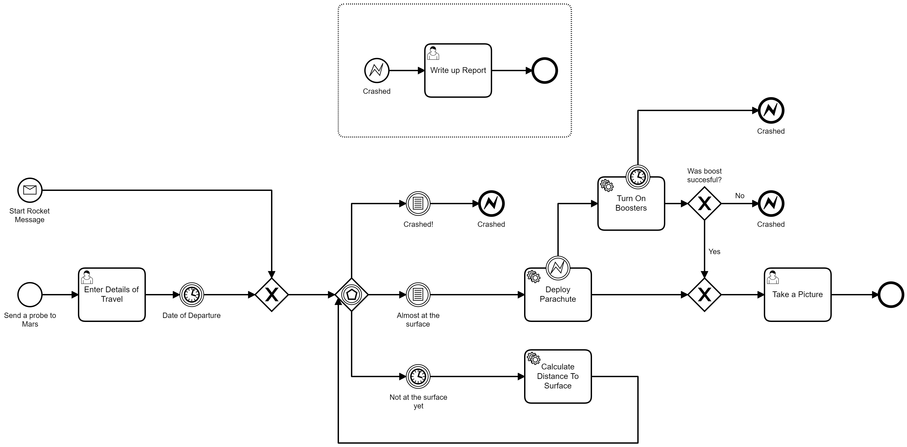

# Camunda Run Land On Mars
This is an example of how you can run quite a complex process with advanced BPMN symbols and templating service tasks

## What You will Need
* [Java JDK 11](https://www.oracle.com/java/technologies/javase-jdk11-downloads.html) so that you can run Camunda Platform Run
* [Camunda Platform Run](https://camunda.com/download/) for running BPMN models
* [Camunda Modeler](https://camunda.com/download/modeler/) for building and deploying BPMN Models
* [NodeJS](https://nodejs.org/en/download/) for running JavaScript external task workers.
* Some kind of developer tooling like [Visual Studio Code](https://code.visualstudio.com/) 


## What you will do

You'll built this process.


Use JavaScript External Task workers. 
```JavaScript
const { Client, logger } = require("camunda-external-task-client-js");
const { Variables } = require("camunda-external-task-client-js");

// configuration for the Client:
//  - 'baseUrl': url to the Process Engine
//  - 'logger': utility to automatically log important events
const config = { baseUrl: "http://localhost:8080/engine-rest", use: logger, asyncResponseTimeout: 5000};

// create a Client instance with custom configuration
const client = new Client(config);

// susbscribe to the topic: 'creditScoreChecker'
client.subscribe("CalculateDistanceToSurface", async function({ task, taskService }) {
  // Put your business logic
  const processVariables = new Variables();
  var lastKnownDistance = task.variables.get("lastKnownDistance");

  newKnownDistance = lastKnownDistance - Math.floor(Math.random() * 100);

  processVariables.set("lastKnownDistance", newKnownDistance);
  console.log('Distance left to Mars '+ newKnownDistance )
  // complete the task
  await taskService.complete(task, processVariables);
});
```

With Camunda Modeler Templates
```json
 "$schema": "https://unpkg.com/@camunda/element-templates-json-schema@0.3.0/resources/schema.json",
  "name": "Calculate Distance To Surface",
  "description": "This is a service which helps work out how close you are to the surface of Mars",
  "id": "aaf398e7-4fee-4c2b-9aa8-c3e948df15e5",
  "appliesTo": [
    "bpmn:ServiceTask"
  ],
  "properties": [
    {
      "type": "Hidden",
      "value": "external",
      "binding": {
        "type": "property",
        "name": "camunda:type"
      }
    },
    {
      "type": "String",
      "value": "CalculateDistanceToSurface",
      "editable": false,
      "binding": {
        "type": "property",
        "name": "camunda:topic"
      }
    },

```


## How To @TODO
