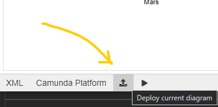
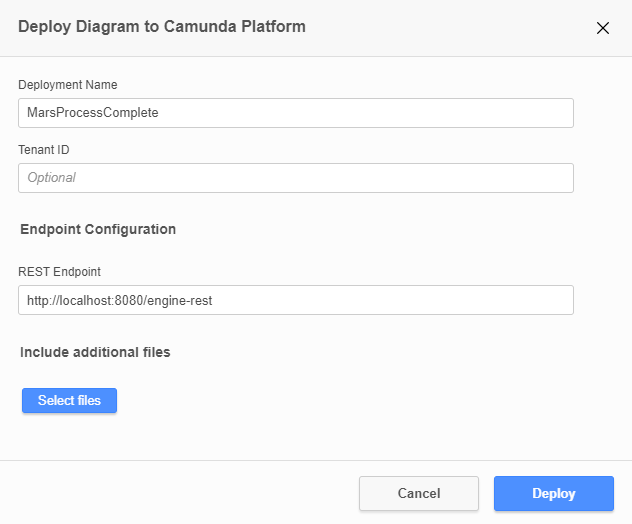

# Camunda Run Land On Mars
This is an example of how you can run quite a complex process with advanced BPMN symbols and templating service tasks

## What You will Need
* [Java JDK 11](https://www.oracle.com/java/technologies/javase-jdk11-downloads.html) so that you can run Camunda Platform Run
* [Camunda Platform Run](https://camunda.com/download/) for running BPMN models
* [Camunda Modeler](https://camunda.com/download/modeler/) for building and deploying BPMN Models
* [NodeJS](https://nodejs.org/en/download/) for running JavaScript external task workers.
* Some kind of developer tooling like [Visual Studio Code](https://code.visualstudio.com/) 


## What you will do

You'll built this process.


Use JavaScript External Task workers to complete service tasks! 
```JavaScript
const { Client, logger } = require("camunda-external-task-client-js");
const { Variables } = require("camunda-external-task-client-js");

// configuration for the Client:
//  - 'baseUrl': url to the Process Engine
//  - 'logger': utility to automatically log important events
const config = { baseUrl: "http://localhost:8080/engine-rest", use: logger, asyncResponseTimeout: 5000};

// create a Client instance with custom configuration
const client = new Client(config);

// susbscribe to the topic: 'creditScoreChecker'
client.subscribe("CalculateDistanceToSurface", async function({ task, taskService }) {
  // Put your business logic
  const processVariables = new Variables();
  var lastKnownDistance = task.variables.get("lastKnownDistance");

  newKnownDistance = lastKnownDistance - Math.floor(Math.random() * 100);

  processVariables.set("lastKnownDistance", newKnownDistance);
  console.log('Distance left to Mars '+ newKnownDistance )
  // complete the task
  await taskService.complete(task, processVariables);
});
```

With Camunda Modeler Templates
```json
 "$schema": "https://unpkg.com/@camunda/element-templates-json-schema@0.3.0/resources/schema.json",
  "name": "Calculate Distance To Surface",
  "description": "This is a service which helps work out how close you are to the surface of Mars",
  "id": "aaf398e7-4fee-4c2b-9aa8-c3e948df15e5",
  "appliesTo": [
    "bpmn:ServiceTask"
  ],
  "properties": [
    {
      "type": "Hidden",
      "value": "external",
      "binding": {
        "type": "property",
        "name": "camunda:type"
      }
    },
    {
      "type": "String",
      "value": "CalculateDistanceToSurface",
      "editable": false,
      "binding": {
        "type": "property",
        "name": "camunda:topic"
      }
    },

```


## Add Templates to the Modeler

There are 3 template files quite conveniently located in the folder called `Templates`. Copy these files to the Camunda modeler by either
finding or creating the `resources/element-templates` folder, relative to the modelers executable or relative to the modelers data directory (see below). Alternatively, they can be stored in a .camunda/element-templates directory that resides, relative to the currently opened diagram, anywhere in the diagrams path hierarchy

You'll know it's worked if you can select a service task and then be able to see the `Open Catalog` button.


More information on modeler templates can be [found here](https://github.com/camunda/camunda-modeler/tree/develop/docs/element-templates#configuring-templates). 

## Deploy the model

In keeping with the theme of putting things in the folders that they belong it, I've put the process model into a folder called `ProcessModel` - To deploy you just need to make sure that you've started up the Camunda Engine and then simply open the model in the Camunda Modeler and clicking the deploy button to deploy it. 



## Run the workers

Workers in Camunda can be written in a number of different languages, in this example i'm using JavaScript. It's pretty easy to start them up. Go to the `MarsWorkersJS` directory open up a terminal window and run the following command to install the dependencies. 
```
npm install -s camunda-external-task-client-js
```
Then for each worker you can run
```
node .\CalculateDistanceToSurface.js
```
```
node .\DeployParachute.js
```
```
node .\TurnOnBoostersWorker.js
```
You'll know it's running correctly when you see this in the console for each worker.
```
✓ subscribed to topic CalculateDistanceToSurface
```

## Open Camunda Webapps

You can now access the Camunda webapps by going to the following URL
``http://localhost:8080/camunda/app/welcome/default``. 
By default the username and password is `demo/demo`

You can start the process instance by going to the tasklist webbapp and clicking Start Process in the top right and selecting the mars process. 

You can view the process status by navigating to cockpit or following this link:
``localhost:8080/camunda/app/cockpit/default/#/processes`` 

Have fun!


